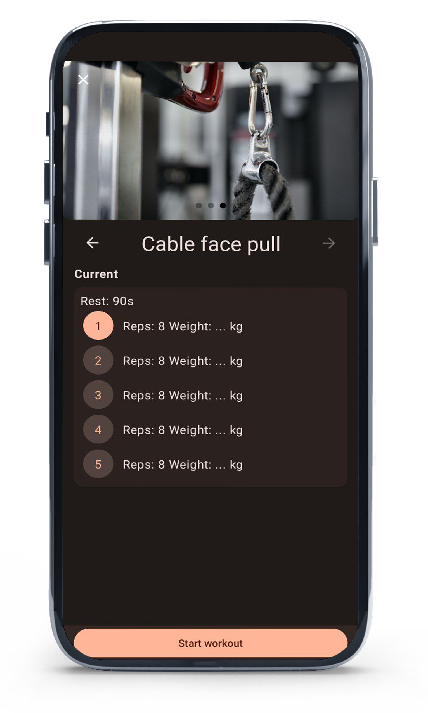

# Parameters

_In the examples below, we can see some of the features available in our mobile app, where the investor will be able to choose their category, they will also be able to measure the repetitions._

<figure><figcaption></figcaption></figure>

 

<figure><figcaption></figcaption></figure>

 

<figure><figcaption></figcaption></figure>

